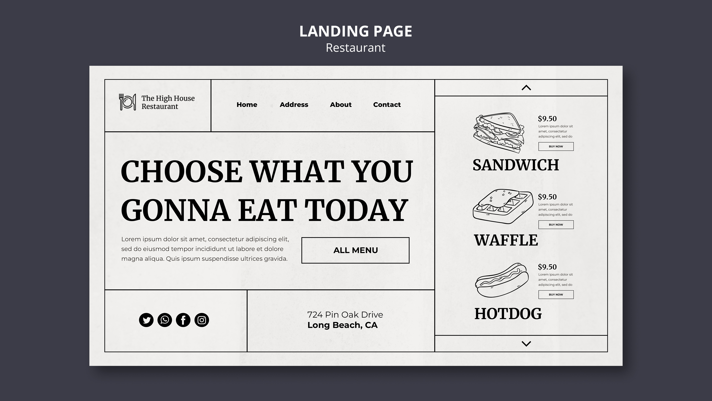

# Context
The purpose of this project is to learn the basis of css throught the creation of react page/components.

Currently it contains two exercices :  
 - Structurate [predefined components](src/components/RestaurantComponents) to make a page that looks like : 
    
 - Update (custom components)[src/components/SpecificCaseComponents/] to override the default css of an antd component ([Table filter](https://ant.design/components/table)).

# Code Base
This project was bootstrapped with [Create antd create react-app](https://ant.design/docs/react/use-with-create-react-app).

## Available Scripts

In the project directory, you can run:

### `yarn start`

Runs the app in the development mode.\
Open [http://localhost:3000](http://localhost:3000) to view it in your browser.

The page will reload when you make changes.\
You may also see any lint errors in the console.

## Learn More

You can learn more in the [Create React App documentation](https://facebook.github.io/create-react-app/docs/getting-started).

To learn React, check out the [React documentation](https://reactjs.org/).
